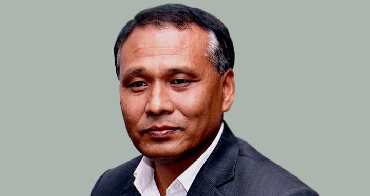
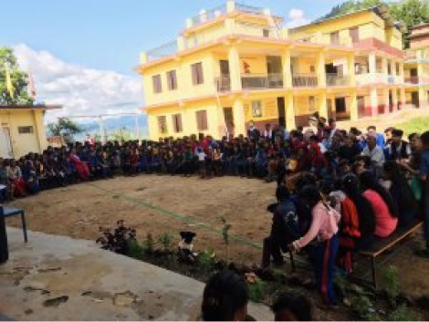
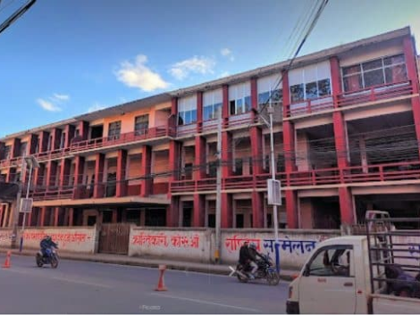
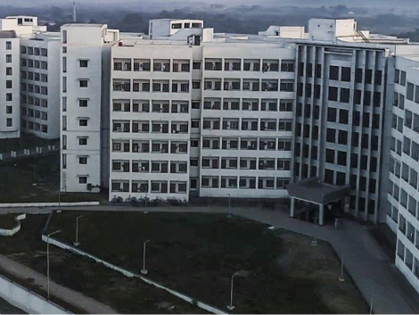
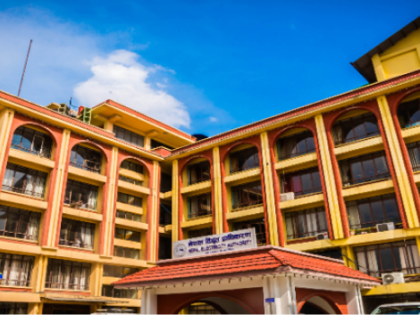
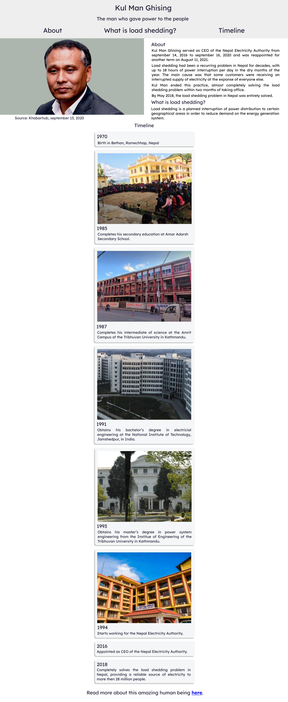
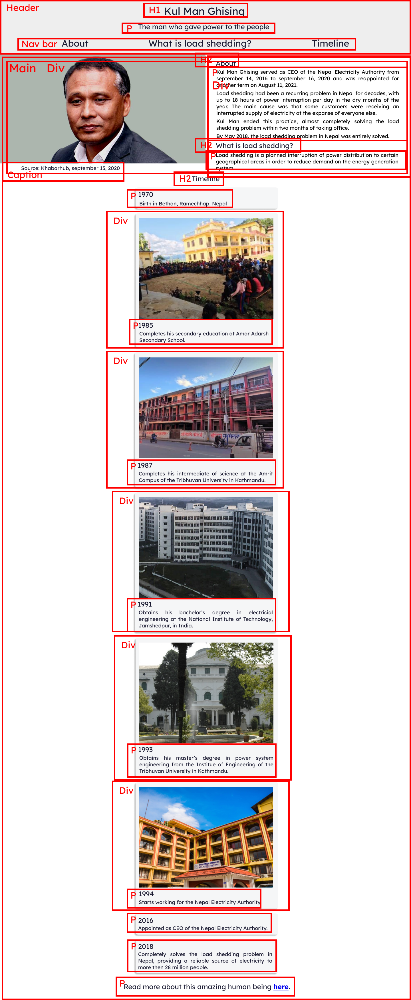
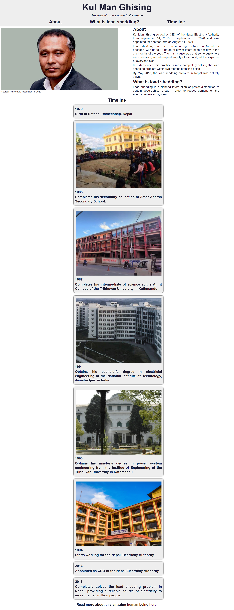

# Tribute page

This is the second project done to obtain the Free Code Camp Responsive Web Design certification.

<details>
  <summary>HTML code</summary>
  
```html

<!DOCTYPE html>
<html lang="en">
  <head>
    <meta charset="UTF-8" />
    <meta name="viewport" content="width=device-width, initial-scale=1.0" />
    <meta name="description" content="A tribute page to Kul Man Ghising" />
    <title>A tribute page to Kul Man Ghising</title>
    <link rel="stylesheet" href="styles.css" />
  </head>
  <body>
    <header>
        <h1 id="title">Kul Man Ghising</h1>
        <p>The man who gave power to the people</p>
        <nav>
            <ul>
                <li><h2><a href="#about">About</a></h2></li>
                <li><h2><a href="#load-shedding">What is load shedding?</a></h2></li>
                <li><h2><a href="#timeline">Timeline</a></h2></li>
            </ul>
        </nav>
    </header>
    <main id="main">
        <section class="picture-main-text">
            <figure id="img-div">
                
                <figcaption id="img-caption">Source: Khabarhub, september 13, 2020</figcaption>
            </figure>
            <div id="tribute-info" class="main-text">
                <h2 id="about">About</h2>
                <p>
                    Kul Man Ghising served as CEO of the Nepal Electricity Authority from september 14, 2016 
                    to september 16, 2020 and was appointed for another term on August 11, 2021.
                </p>
                <p>
                    Load shedding had been a recurring problem in Nepal for decades, with up to 18 hours of power 
                    interruption per day in the dry months of the year. The main cause was that some customers were 
                    receiving an interrupted supply of electricity at the expanse of everyone else.
                </p>
                <p>
                    Kul Man ended this practice, almost completely solving the load shedding problem within two 
                    months of taking office.
                </p>
                <p>
                    By May 2018, the load shedding problem in Nepal was entirely solved.
                </p>
                <h2 id="load-shedding">What is load shedding?</h2>
                <p>
                    Load shedding is a planned interruption of power distribution to certain geographical areas 
                    in order to reduce demand on the energy generation system.
                </p>
            </div>
        </section>
        <h2 id="timeline">Timeline</h2>
        <div class="tag-section">
            <section class="tag">
                <h3>1970</h3>
                <h3>Birth in Bethan, Ramechhap, Nepal</h3>
            </section>
            <section class="tag">
                
                <h3>1985</h3>
                <h3>Completes his secondary education at Amar Adarsh Secondary School.</h3>
            </section>
            <section class="tag">
                
                <h3>1987</h3>
                <h3>
                    Completes his intermediate of science at the Amrit Campus of the Tribhuvan 
                    University in Kathmandu.
                </h3>
            </section>
            <section class="tag">
                
                <h3>1991</h3>
                <h3>
                    Obtains his bachelor’s degree in electricial engineering at the National 
                    Institute of Technology, Jamshedpur, in India.
                </h3>
            </section>
            <section class="tag">
                
                <h3>1993</h3>
                <h3>
                    Obtains his master’s degree in power system engineering from the Institue of 
                    Engineering of the Tribhuvan University in Kathmandu.
                </h3>
            </section>
            <section class="tag">
                
                <h3>1994</h3>
                <h3>
                    Starts working for the Nepal Electricity Authority.
                </h3>
            </section>
            <section class="tag">
                <h3>2016</h3>
                <h3>Appointed as CEO of the Nepal Electricity Authority.</h3>
            </section>
            <section class="tag">
                <h3>2018</h3>
                <h3>
                    Completely solves the load shedding problem in Nepal, 
                    providing a reliable source of electricity to more then 28 million people.
                </h3>
            </section>
        </div>
        <h3 class="final-link">Read more about this amazing human being <a id="tribute-link" href="https://en.wikipedia.org/wiki/Kul_Man_Ghising" target="_blank">here</a>.</h3>
    </main>
  </body>
</html>

```

</details>

<details>
  <summary>CSS code</summary>
  
```css

@media (prefers-reduced-motion: no-preference) {
    * {
      scroll-behavior: smooth;
    }
  }

body {
    background-color: #FFFFFF;
    color: #1B1B32;
    font-size: 16px;
    margin: 0;
    padding: 0;
    font-family: Arial, Helvetica, sans-serif;
    width: 100%;
}

header {
    background-color: #EEEEEE;
    width: 100%;
    margin: 0;
    padding: 0;
}

h1 {
    font-size: 3em;
    margin: 0;
    text-align: center;
    padding: 0.25em 0 0 0;
}

header h2 {
    margin: 0;
    padding: 0 0 0.1em 0;
}

header > p {
    margin: 0;
    text-align: center;
    font-style: italic;
    padding: 0.5em 0;
}

nav {
    width: 70%;
    min-width: 475px;
    padding-top: 0.25em;
    padding-bottom: 0.5em;
    margin: 0 auto;
}

nav > ul {
    display: flex;
    align-items: center;
    justify-content: space-around;
    list-style: none;
    margin: 0;
    padding: 0;
    height: 100%;
}

header a {
    color: #1B1B32;
    text-decoration: none;
    padding: 0.1em 0.2em;
}

header a:hover {
    background-color: #1B1B32;
    color: #EEEEEE;  
}

main {
    margin: 0;
    padding: 0;
}

.picture-main-text {
    display: flex;
    justify-content: center;
    flex-wrap: wrap;
    min-width: 475px;
}

figure {
    margin: 0.5% 0 0 0.5%;
    padding: 0;
    width: 50%;
    min-width: 475px;
}

figure img {
    max-width: 100%;
    height: auto;
    display: block;
}

figure figcaption {
    font-size: 12px;
}

.picture-main-text > div {
    width: 475px;
    min-width: 475px;
    margin: 0 auto;
}

main h2 {
    text-align: center;
    margin: 0 0 0.5em 0;
    padding: 0.25em 0 0 0;
}

.tag-section {
   width: 475px;
   margin: 0 auto;
   display: flex;
   flex-direction: column;
   align-items: flex-start;
   gap: 1em;
}

.main-text h2 {
    margin: 0;
    padding: 0.1em;
    text-align: justify;
}

.main-text p {
    margin: 0;
    padding: 0.1em;
    line-height: 1.25em;
    text-align: justify;
}

.tag {
    display: flex;
    flex-direction: column;
    justify-content: flex-start;
    margin: 0;
    width: 475px;
    padding: 0.5em;
    background-color: #EEEEEE;
    border-radius: 9px;
    box-shadow: 0 0 0.30em #000000;
}

.tag h3 {
    margin: 0;
    padding: 0.1em 0;
    text-align: justify;
    line-height: 1.25em;
}

.tag img {
    align-self: center;
    margin: 0 auto;
    padding: 0.4em 0;
}

.final-link {
    text-align: center;
}

```

</details>

## Sketch


## High fidelity prototype



## HTML skeleton



## Final result



